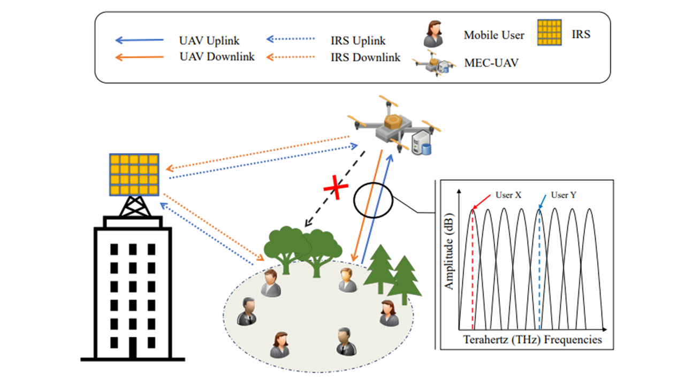

# MEC-enabled-UAV-with-IRS-assisted-6G-THz-Networks

## Overview
This is the Simulation code for MEC enabled UAV with IRS assisted 6G THz Networks

Terrahertz (THz) communication is likely to enable ultra-fast data speeds in sixth-generation (6G) wireless networks. On the other hand, intelligent reflective surfaces (IRSs) can affect incident electromagnetic propagation by changing phase shifts to manual reflective components. It is possible to improve spectral efficiency and coverage capabilities, and minimize cut-off vulnerabilities due to severe THz propagation attenuation and poor diffraction. Recently, unmanned aerial vehicles (UAVs) have provided services of airborne-based multi-access edge computing (MECs) in a ubiquitous manner. Motivated by the above facts, this paper considers an IRS-enabled MEC-enabled UAV system for 6GHz communication networks. To this end, we explore a joint optimization of UAV computational capability, IRS phase shift, and THz subband allocation to reduce total network latency. However, the designed problem is difficult to solve in polynomial time with mixed integer nonlinear programming (MINLP). Thus, to solve this problem, an iterative algorithm based on the Hungarian algorithm and the Whale Optimization Algorithm (WOA) is proposed. The Hungarian algorithm optimizes the subband allocation while the WOA optimizes the IRS phase shift.

## Version
- Unity 2020.3.25f1
- ML-agents Release 17
- python 3.8
- Pytorch 1.8.0

## License
Copyright (c) 2022 Networking Intelligence
Redistribution and use in source and binary forms, with or without modification, are permitted provided that the following conditions are met:

1. Redistributions of source code must retain the above copyright notice, this list of conditions and the following disclaimer.

2. Redistributions in binary form must reproduce the above copyright notice, this list of conditions and the following disclaimer in the documentation and/or other materials provided with the distribution.

THIS SOFTWARE IS PROVIDED BY THE COPYRIGHT HOLDERS AND CONTRIBUTORS "AS IS" AND ANY EXPRESS OR IMPLIED WARRANTIES, INCLUDING, BUT NOT LIMITED TO, THE IMPLIED WARRANTIES OF MERCHANTABILITY AND FITNESS FOR A PARTICULAR PURPOSE ARE DISCLAIMED. IN NO EVENT SHALL THE COPYRIGHT HOLDER OR CONTRIBUTORS BE LIABLE FOR ANY DIRECT, INDIRECT, INCIDENTAL, SPECIAL, EXEMPLARY, OR CONSEQUENTIAL DAMAGES (INCLUDING, BUT NOT LIMITED TO, PROCUREMENT OF SUBSTITUTE GOODS OR SERVICES; LOSS OF USE, DATA, OR PROFITS; OR BUSINESS INTERRUPTION) HOWEVER CAUSED AND ON ANY THEORY OF LIABILITY, WHETHER IN CONTRACT, STRICT LIABILITY, OR TORT (INCLUDING NEGLIGENCE OR OTHERWISE) ARISING IN ANY WAY OUT OF THE USE OF THIS SOFTWARE, EVEN IF ADVISED OF THE POSSIBILITY OF SUCH DAMAGE.
